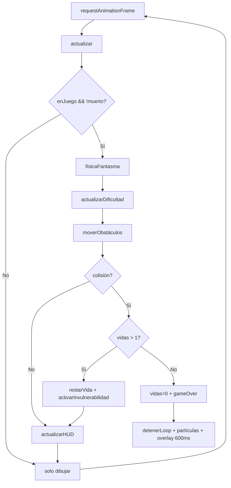

# Diseño Técnico — Sistema de Vidas y Dificultad Progresiva

## Overview

El objetivo es extender el juego **Kiro Ghost Runner** (vanilla JS, `script.js` + `index.html` + `styles.css`) con cuatro subsistemas integrados en la arquitectura existente de loop `requestAnimationFrame`:

1. **Sistema_de_Vidas** — gestión de 3 vidas, invulnerabilidad temporal y flujo de game over.
2. **Sistema_de_Dificultad** — velocidad e intervalo de obstáculos vinculados a los puntos con fórmulas deterministas.
3. **Persistencia de High Score** — lectura/escritura en `localStorage` con manejo de errores.
4. **HUD ampliado + Overlay de Game Over** — representación visual de vidas, puntaje, récord y botón de reinicio.

Toda la lógica vive en los tres archivos actuales; no se añaden dependencias ni estructura de carpetas adicional.

---

## Architecture

El juego sigue una arquitectura de **estado global mutable + loop único**:

```
┌─────────────────────────────────────────────────┐
│                  script.js                       │
│                                                  │
│  Estado global ──► actualizar() ──► dibujar()   │
│        │                │                │       │
│        │           Sistema de         HUD DOM    │
│        │         Vidas / Dificultad             │
│        │                │                        │
│        └──── localStorage (highScore) ──────────┘
└─────────────────────────────────────────────────┘
```

### Flujo de ejecución por frame



### Flujo de invulnerabilidad

```mermaid
sequenceDiagram
    participant Loop
    participant SistemaVidas
    participant Fantasma

    Loop->>SistemaVidas: colisión detectada
    SistemaVidas->>SistemaVidas: vidas -= 1
    SistemaVidas->>Fantasma: invulnerable = true
    SistemaVidas->>SistemaVidas: setTimeout(2000ms)
    Note over Fantasma: parpadeo 10 Hz (100 ms ON/OFF)
    SistemaVidas-->>Fantasma: invulnerable = false (tras 2000 ms)
```

---

## Components and Interfaces

### 1. Sistema_de_Vidas

Variables de estado que se añaden al bloque de estado global:

```js
let vidas          = 3;      // número de vidas restantes (0–3)
let invulnerable   = false;  // true mientras dure el período de gracia
let timerInvul     = null;   // referencia al setTimeout de invulnerabilidad
```

Funciones nuevas / modificadas:

| Función | Descripción |
|---|---|
| `registrarColision()` | Punto de entrada único para todas las colisiones. Decide si restar vida o activar game over. Reemplaza la lógica inline de `actualizar()`. |
| `activarInvulnerabilidad()` | Fija `invulnerable = true` y programa `setTimeout(desactivarInvulnerabilidad, 2000)`. |
| `desactivarInvulnerabilidad()` | Fija `invulnerable = false` y limpia `timerInvul`. |
| `renderizarHudVidas()` | Actualiza los 3 iconos del DOM (`#hud-vida-1`, `#hud-vida-2`, `#hud-vida-3`) según el valor de `vidas`. |
| `reiniciar()` *(modificada)* | Añade `vidas = 3`, limpia `timerInvul` y reinicia flags. |

### 2. Sistema_de_Dificultad

Las fórmulas existentes en `actualizar()` se refactorizan a dos funciones puras para hacerlas testeables:

| Función | Firma | Descripción |
|---|---|---|
| `calcularVelocidad(puntos)` | `(number) → number` | `Math.min(15, 5 + Math.floor(puntos / 100) * 0.5)` |
| `calcularIntervalo(puntos)` | `(number) → number` | `Math.max(40, 80 - Math.floor(puntos / 100) * 5)` |
| `calcularNivel(puntos)` | `(number) → number` | `1 + Math.floor(puntos / 100)` |

### 3. Persistencia de High Score

| Función | Firma | Descripción |
|---|---|---|
| `cargarHighScore()` | `() → number` | Lee `kiroRunner_highScore` de `localStorage`. Si el valor no es entero ≥ 0, devuelve `0`. |
| `guardarHighScore(puntos)` | `(number) → void` | Solo escribe si `puntos > mejorPuntos`. Captura errores de escritura y muestra mensaje al usuario. |

### 4. HUD ampliado

Se añaden al DOM tres iconos de vida y se modifica el overlay:

```html
<!-- Nuevo elemento en #hud -->
<div id="hud-vidas">
  <span id="hud-vida-1">👻</span>
  <span id="hud-vida-2">👻</span>
  <span id="hud-vida-3">👻</span>
</div>
```

Los iconos activos llevan la clase `.vida-activa` (color completo); los inactivos llevan `.vida-inactiva` (opacidad 0.25 en escala de grises).

### 5. Overlay de Game Over

El overlay existente `#overlay` se reutiliza modificando su contenido en `mostrarGameOver()`:

- `tituloOverlay.textContent` → `"JUEGO TERMINADO"`
- `puntajeFinal.textContent` → `"Puntaje: X | Récord: Y"` (y opcionalmente `"¡Nuevo récord!"`)
- `btnJugar.textContent` → `"REINTENTAR"`

La función `formatearPuntajeFinal(puntos, highScore, esNuevoRecord)` produce el string completo.

---

## Data Models

### Estado global extendido

```js
// ── Vidas ─────────────────────────────────────────────────────
let vidas        = 3;        // entero [0, 3]
let invulnerable = false;    // boolean
let timerInvul   = null;     // NodeJS/browser timer ID | null

// ── High Score ────────────────────────────────────────────────
let mejorPuntos  = 0;        // entero ≥ 0, cargado de localStorage al inicio

// ── Variables ya existentes que se reemplazan / afectan ───────
// puntos, nivel, velocidad, intervaloObs — ahora calculados por
// calcularNivel(), calcularVelocidad(), calcularIntervalo()
```

### Modelo de icono de vida (DOM)

```
span#hud-vida-N
  classList: ["vida-activa"]   si N <= vidas
             ["vida-inactiva"] si N >  vidas
  contenido: emoji "👻"
```

### Clave de localStorage

| Clave | Tipo | Válido | Fallback |
|---|---|---|---|
| `kiroRunner_highScore` | string (entero) | `parseInt >= 0` | `0` |

---

## Correctness Properties

*Una propiedad es una característica o comportamiento que debe cumplirse en todas las ejecuciones válidas del sistema — es decir, una declaración formal sobre lo que el sistema debe hacer. Las propiedades sirven de puente entre las especificaciones legibles por humanos y las garantías de corrección verificables por máquina.*

### Property 1: Inicialización de vidas

*Para cualquier* número de veces que se llame a `reiniciar()`, el contador `vidas` debe ser exactamente `3` al finalizar la llamada.

**Validates: Requirements 1.1**

---

### Property 2: Sincronización de iconos con el estado de vidas

*Para cualquier* valor entero `v` en el rango `[0, 3]`, tras llamar a `renderizarHudVidas(v)` debe haber exactamente `v` iconos con clase `vida-activa` y exactamente `3 - v` iconos con clase `vida-inactiva`.

**Validates: Requirements 1.2, 1.4**

---

### Property 3: Colisión resta exactamente una vida y activa invulnerabilidad

*Para cualquier* valor de `vidas` en `[2, 3]`, tras llamar a `registrarColision()` el contador debe ser `vidas - 1` y `invulnerable` debe ser `true`. Si `vidas` era `1`, el contador debe llegar a `0` e `invulnerable` debe permanecer `false`.

**Validates: Requirements 2.1, 2.2, 3.1**

---

### Property 4: Invulnerabilidad bloquea colisiones posteriores

*Para cualquier* número de llamadas a `registrarColision()` mientras `invulnerable === true`, el valor de `vidas` no debe cambiar respecto al valor que tenía cuando comenzó el estado de invulnerabilidad.

**Validates: Requirements 2.3**

---

### Property 5: Parpadeo determinista durante invulnerabilidad

*Para cualquier* timestamp `t` dentro del período de invulnerabilidad `[t₀, t₀ + 2000)`, la visibilidad calculada del fantasma debe ser `Math.floor((t - t₀) / 100) % 2 === 0` (visible en ciclos pares, invisible en impares), produciendo exactamente 10 Hz.

**Validates: Requirements 2.6**

---

### Property 6: Entradas ignoradas mientras el overlay está visible

*Para cualquier* evento de teclado o puntero cuyo código no sea el de "REINTENTAR" mientras `!enJuego && muerto` (overlay de game over visible), el estado del juego (`vidas`, `puntos`, `nivel`, `velocidad`) no debe cambiar.

**Validates: Requirements 3.5**

---

### Property 7: Velocidad calculada es monótonamente creciente y acotada

*Para cualquier* valor de `puntos` en `[0, +∞)`, `calcularVelocidad(puntos)` debe satisfacer:
- `calcularVelocidad(puntos) >= 5`
- `calcularVelocidad(puntos) <= 15`
- Si `puntos₂ > puntos₁` y ambos son múltiplos de 100 diferentes, entonces `calcularVelocidad(puntos₂) >= calcularVelocidad(puntos₁)`.

**Validates: Requirements 4.1**

---

### Property 8: Intervalo calculado es monótonamente decreciente y acotado

*Para cualquier* valor de `puntos` en `[0, +∞)`, `calcularIntervalo(puntos)` debe satisfacer:
- `calcularIntervalo(puntos) >= 40`
- `calcularIntervalo(puntos) <= 80`
- Si `puntos₂ > puntos₁` y ambos son múltiplos de 100 diferentes, entonces `calcularIntervalo(puntos₂) <= calcularIntervalo(puntos₁)`.

**Validates: Requirements 4.2**

---

### Property 9: Nivel calculado es función pura y monótonamente no-decreciente

*Para cualquier* valor de `puntos` en `[0, +∞)`, `calcularNivel(puntos)` debe ser igual a `1 + Math.floor(puntos / 100)` y debe ser mayor o igual a `calcularNivel(puntos - 1)` (no decrece).

**Validates: Requirements 4.4**

---

### Property 10: Round-trip de High Score en localStorage

*Para cualquier* entero `n >= 0`, si `guardarHighScore(n)` escribe el valor y luego `cargarHighScore()` lo lee, el resultado debe ser igual a `n`.

**Validates: Requirements 5.1, 5.2**

---

### Property 11: Valores inválidos en localStorage producen High Score = 0

*Para cualquier* valor `v` que no sea un entero `>= 0` (incluyendo `null`, `undefined`, `NaN`, cadenas no numéricas, números negativos, decimales), `cargarHighScore()` debe devolver `0`.

**Validates: Requirements 5.3**

---

### Property 12: Formato del overlay siempre es correcto

*Para cualquier* par de enteros `(puntaje, highScore)` ambos `>= 0`, `formatearPuntajeFinal(puntaje, highScore, false)` debe devolver exactamente `"Puntaje: ${puntaje} | Récord: ${highScore}"`.

**Validates: Requirements 6.2**

---

### Property 13: "¡Nuevo récord!" aparece si y solo si se supera el récord previo

*Para cualquier* par `(puntaje, highScorePrevio)` donde `puntaje > highScorePrevio`, `formatearPuntajeFinal(puntaje, highScorePrevio, true)` debe incluir la cadena `"¡Nuevo récord!"`. Si `puntaje <= highScorePrevio`, la cadena no debe aparecer.

**Validates: Requirements 6.3**

---

### Property 14: Reinicio restaura estado inicial completo

*Para cualquier* estado de partida (vidas arbitrarias, puntos arbitrarios, nivel arbitrario), tras llamar a `reiniciar()` e `iniciarPartida()`, el estado debe ser: `vidas === 3`, `puntos === 0`, `nivel === 1`, `invulnerable === false`, overlay con clase `oculto`.

**Validates: Requirements 6.4, 6.5, 1.1**

---

## Error Handling

| Escenario | Manejo |
|---|---|
| `localStorage.setItem` lanza `QuotaExceededError` o cualquier excepción | `try/catch` en `guardarHighScore()`: el `mejorPuntos` en memoria se mantiene actualizado; se muestra un mensaje de error en español al usuario (ej. en el overlay o como banner temporal). |
| `localStorage.getItem` devuelve valor no numérico / null | `cargarHighScore()` devuelve `0`; nunca lanza. |
| `cancelAnimationFrame` llamado con `frameId` nulo | Guard `if (frameId) cancelAnimationFrame(frameId)` (ya existe). |
| `setTimeout` de invulnerabilidad activo al reiniciar | `reiniciar()` llama `clearTimeout(timerInvul)` antes de resetear. |
| Error en `registrarColision()` | `try/catch` con `console.error` en español; no propaga la excepción para no romper el loop. |

Todos los mensajes de error visibles al usuario se muestran en español, siguiendo la convención del proyecto.

---

## Testing Strategy

### Enfoque dual

Se combinan **tests de ejemplo** (comportamientos específicos y flujos con temporizadores) y **tests de propiedad** (corrección universal de funciones puras y transformaciones de estado).

### Tests de propiedad (Property-Based Testing)

Se utiliza **[fast-check](https://fast-check.dev/)** como librería PBT, ejecutada directamente en el navegador o mediante un runner ligero sin bundler. Cada test corre un **mínimo de 100 iteraciones**.

Cada propiedad de este documento se implementa como un test con el tag:

```
Feature: lives-and-difficulty-system, Property N: <texto de la propiedad>
```

| Property | Generadores fast-check | Qué se verifica |
|---|---|---|
| P1 – Inicialización de vidas | N llamadas a `reiniciar()` | `vidas === 3` siempre |
| P2 – Iconos HUD | `fc.integer({min:0, max:3})` | conteo de clases DOM |
| P3 – Colisión resta vida | `fc.integer({min:1, max:3})` para vidas | vidas decrementado, flag invulnerable correcto |
| P4 – Invulnerabilidad bloquea | N llamadas a `registrarColision()` con `invulnerable=true` | vidas inalterado |
| P5 – Parpadeo 10 Hz | `fc.integer({min:0, max:1999})` para offset temporal | visibilidad == fórmula esperada |
| P6 – Entradas ignoradas | `fc.string()` para código de tecla | estado inalterado |
| P7 – Velocidad acotada | `fc.nat()` para puntos | bounds y monotonía |
| P8 – Intervalo acotado | `fc.nat()` para puntos | bounds y monotonía |
| P9 – Nivel puro | `fc.nat()` para puntos | igualdad con fórmula y no-decrecimiento |
| P10 – Round-trip localStorage | `fc.nat()` para highScore | cargar(guardar(n)) == n |
| P11 – Valores inválidos | `fc.oneof(fc.string(), fc.double({noInteger:true}), fc.constant(null))` | resultado == 0 |
| P12 – Formato overlay | `fc.nat()` × 2 para puntaje y récord | string exacto |
| P13 – "¡Nuevo récord!" | `fc.nat()` × 2 con `puntaje > highScore` / `puntaje <= highScore` | presencia/ausencia del texto |
| P14 – Reinicio completo | Estado arbitrario previo | todos los campos en valor inicial |

### Tests de ejemplo (unit / integración)

Los siguientes criterios se verifican con tests de ejemplo concretos (no PBT), usando **fake timers** para el timing:

| Criterio | Tipo de test |
|---|---|
| 1.3 – HUD actualizado en mismo frame | Ejemplo: llamar a `actualizar()` y verificar DOM |
| 2.4 / 2.5 – Duración exacta de 2 000 ms | Ejemplo con `setTimeout` mockeado |
| 3.2 / 3.3 – Loop detenido + overlay a 600 ms | Ejemplo con fake timers |
| 3.4 – Fallback si partículas fallan | Ejemplo con función de partículas mockeada que lanza |
| 4.3 – HUD nivel actualizado en mismo frame | Ejemplo: llamar a `actualizar()` y verificar DOM |
| 5.4 – HUD highScore reflejado en ≤ 100 ms | Ejemplo con fake timers |
| 5.5 – Error de escritura en localStorage | Ejemplo con `localStorage.setItem` mockeado para lanzar |
| 6.1 – Overlay visible en ≤ 100 ms tras vidas=0 | Ejemplo con fake timers |

### Equilibrio entre pruebas

- Los tests de propiedad cubren las funciones puras de dificultad y la lógica de estado de vidas, donde la variación de inputs aporta valor real.
- Los tests de ejemplo se centran en los flujos de timing (`setTimeout`, `requestAnimationFrame`) y efectos secundarios DOM, donde un número reducido de escenarios concretos es más adecuado que la iteración masiva.
- No se escriben tests unitarios redundantes para comportamientos ya cubiertos por las propiedades.
